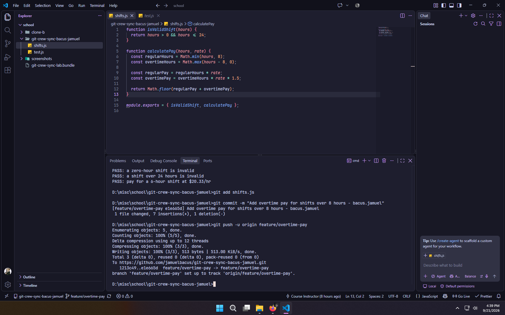
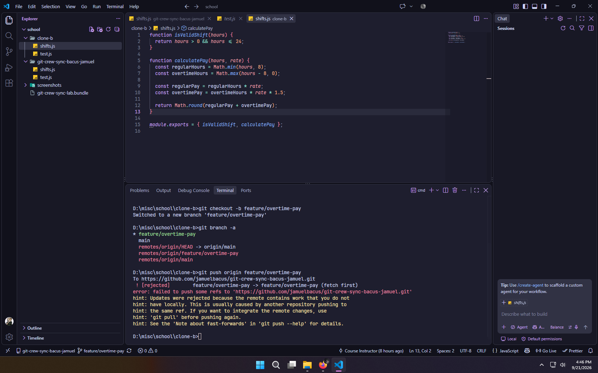
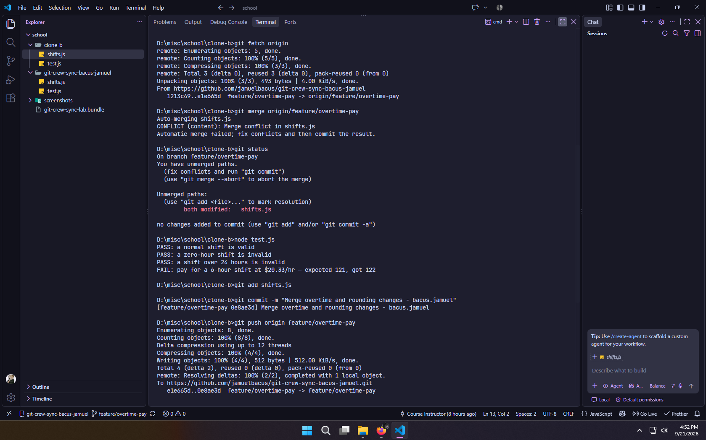
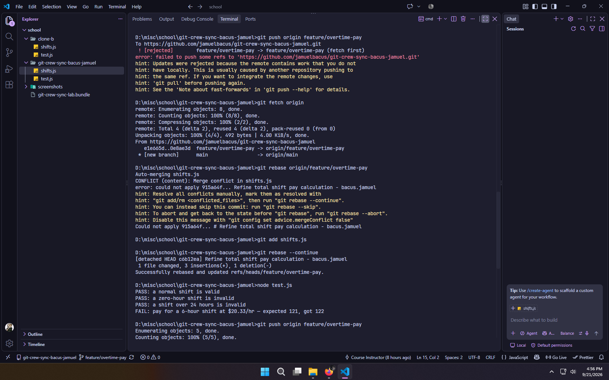
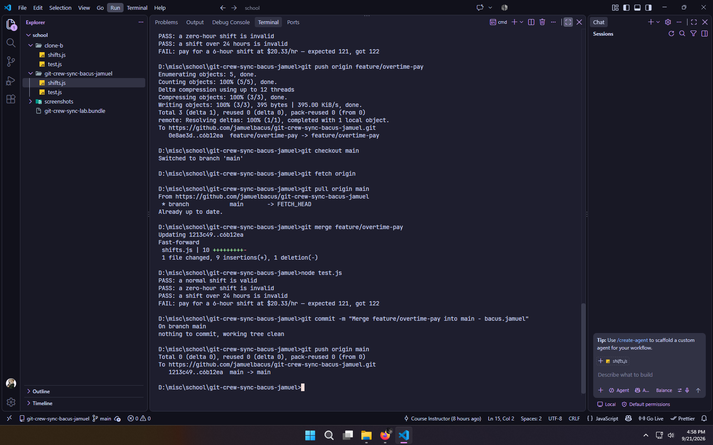
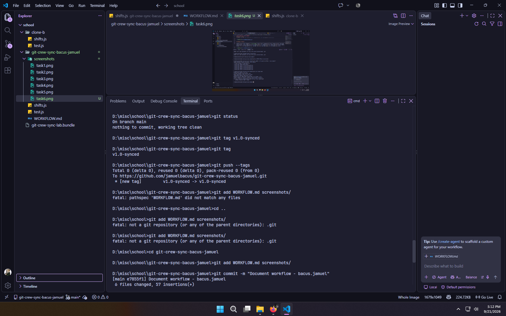

# git-crew-sync-bacus-jamuel

## Task 1: Push from Clone A

Clone A created the `feature/overtime-pay` branch and added regular-pay and overtime-pay calculations. Overtime is paid at time-and-a-half times the regular rate. The change was committed and pushed to GitHub.

## Task 2: Rejected Push from Clone B

Clone B made a different change to the same `calculatePay` function by changing the rounding behavior from `Math.floor()` to `Math.round()`. The commit was created successfully, but the push was rejected because Clone B had not yet fetched Clone A's changes.

## Task 3: Merge

Clone B fetched the remote changes and merged `origin/feature/overtime-pay`. A real conflict occurred in `calculatePay`. The conflict was resolved so that both overtime pay at time-and-a-half times the rate and rounded final pay were preserved. The resolved branch was then pushed successfully.

## Task 4: Rebase

Clone A made another change to `calculatePay` without first fetching the latest remote changes. The push was rejected. Clone A then fetched the remote branch and rebased its local commit onto the updated remote branch. The resulting conflict was resolved, the rebase was continued, and the branch was pushed.

## Task 5: Merge into main

Clone A switched to `main` and merged the completed `feature/overtime-pay` branch into it. The updated `main` branch was pushed to GitHub.

## Task 6: Tag

The final `main` commit was tagged `v1.0-synced` and the tag was pushed to GitHub.

# Reflection

## What did the rejected push error message tell you, and why did it happen?

The rejected push indicated that the remote branch contained commits that were not present in my local branch. Git rejected the push because pushing my local history directly would not be a fast-forward update. I needed to fetch the remote changes and reconcile the histories before pushing again.

## What's the actual difference between how you resolved Task 3 (merge) vs Task 4 (rebase)?

In Task 3, I used a merge to combine the histories of Clone A and Clone B. The merge created a combined history and required resolving the conflict in `calculatePay`.

In Task 4, I used a rebase. My local commit was reapplied on top of the updated remote branch. I resolved the conflict during the rebase and then continued the rebase. Unlike the merge in Task 3, the rebase reorganized the local commit history instead of creating a merge commit for that reconciliation.

## What one habit would have avoided both rejected pushes in this lab?

Fetching and checking the remote branch before starting work would have reduced the chance of both rejected pushes. Keeping the local branch synchronized with the remote branch helps reveal changes made by other contributors before creating new commits.

## Which approach — merge or rebase — would you default to on a shared team branch, and why?

The choice depends on the team's workflow. A merge preserves the branching history and records the point where histories were combined. A rebase creates a more linear history by replaying local commits on top of the updated branch. On a shared branch, the team should follow its established policy and avoid rewriting commits that other people are already relying on.
